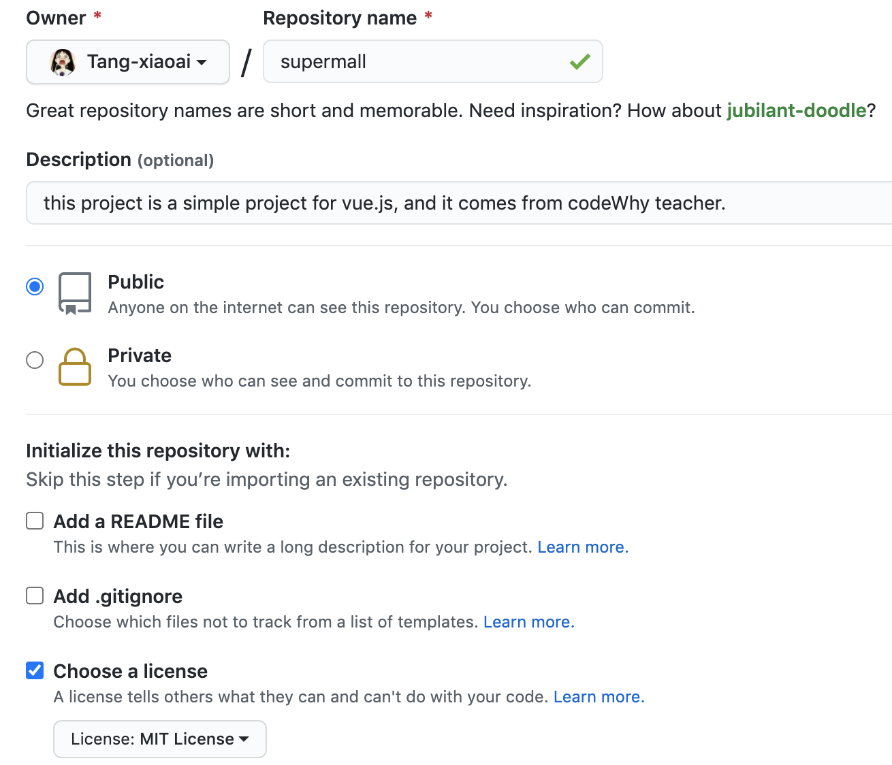

# supermall

## Project setup
```
npm install
```

### Compiles and hot-reloads for development
```
npm run serve
```

### Compiles and minifies for production
```
npm run build
```

### Customize configuration
See [Configuration Reference](https://cli.vuejs.org/config/).

# Steps of this project

## github托管本项目



1.输入仓库名；2.写项目描述；3.选择公开；4.选择license，MIT表示随意公开，Apache 2.0表示需要版权声明。

在自己的电脑上生成ssh密钥，将公钥添加到github个人设置中，后续可以通过密钥clone和push项目。方法自行百度。

## 新建supermall项目

`vue create supermall`，进入到项目根目录，将远程仓库内容pull拉取下来，merge融合后，本地提交并且提交到远程分支tahdev【自己设定】，远程进行pull requests，将分支更新内容合并到main分支上。


